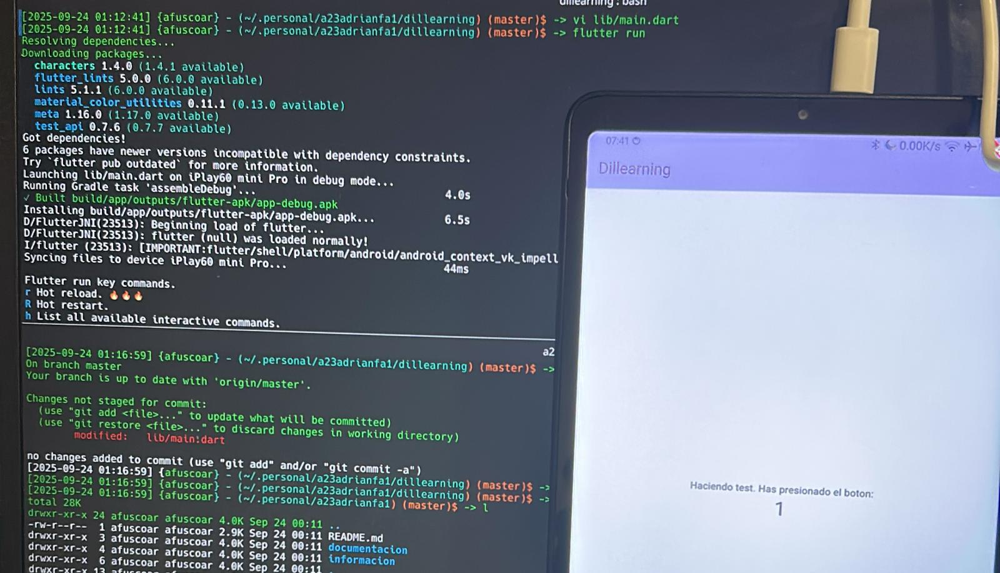

# Dillearning

**Dillearning** (*dil del Turco idioma o lengua*) es una aplicación de aprendizaje de idiomas que busca ofrecer una experiencia amigable,
transparente y enriquecedora para el usuario, añadiendo
temas que son más orientados a un uso más realista del
lenguaje con un enfoque pedagógico sin ser un modelo orientado a la monetización.

## Autor

Soy Adrián y trabajo como Software Engineer en Red Hat desde hace 4 años con un enfoque bastante enfocado a DevOps. Comencé un rol en un equipo llamado Code Reliability Engineering y actualmente me encuentro en un equipo llamado CI Operations en Openstack.

He trabajado en los últimos años principalmente con **Python**.

He querido trabajar en este proyecto porque ya he podido abarcar el área web trabajando con aplicaciones internas hechas en **Fast API** - y en ocasiones **Flask** - para el backend y **React** con **Tailwindcss** para el frontend.

Esta vez quería aprender sobre **Dart** y **Flutter** para realizar aplicaciones multiplataforma y al encantarme los idiomas quería aprovechar la ocasión para realizar una aplicación que ayude con el aprendizaje.

Podéis encontrarme en [LinkedIn](https://www.linkedin.com/in/adrianfusco/).

## Uso

El proyecto está desarrollado usando [Flutter](https://flutter.dev/).

## Índice: Estrutura do proxecto (plantillas de apoio)

El código del proyecto se encuentra en [dillearning](./dillearning/).

## Instalación / Posta en marcha

He hecho el desarrollo en Arch por lo que usaré los comandos de la distribución pero cada distribución tiene sus packages:

Instalamos jdk17:

```
$ pacman -S jdk17-openjdk
```

Instalamos android-sdk y cada una de sus tools:

```
$ yay -S android-sdk android-sdk-build-tools android-sdk-cmdline-tools-latest android-platform android-sdk-platform-tools
```

Exportamos las variables necesarias para la ejecución dependiendo de la carpeta de instalación. Añadimos en nuestro `.bashrc`:

```
export ANDROID_HOME=$HOME/android-sdk
export PATH=$PATH:$ANDROID_HOME/platform-tools
```

Configuramos flutter:

```
$ flutter config --android-sdk ~/android-sdk
$ flutter doctor --android-licenses
```

En mi caso he conectado un dispositivo android y he activado [las opciones para desarrolladores en el dispositivo](https://developer.android.com/studio/debug/dev-options?hl=es-419), lo he conectado y he aceptado permisos (podemos usar emuladores también si no tenemos un dispositivo físico).

Podemos listar los dispositivos disponibles para la ejecución:

```
$ flutter devices
Found 2 connected devices:
  iPlay60 mini Pro (mobile) • T123 • android-arm64 • Android 14 (API 34)
  Linux (desktop)           • linux                • linux-x64     • Arch Linux 6.16.8-arch1-1
...
```

Y si todo está instalado correctamente, podemos ejecutarlo. Para seleccionar un dispositivo en concreto podemos usar el parámetro `-d` con su `deviceID`. Por ejemplo, para la versión de escritorio:

```
# Para ejecutar en nuestro Linux:
$ flutter run -d linux
# Para ejecutar en nuestro dispositivo android:
$ flutter run -d T123
```

Si no se especifica, se usará el por defecto:

```
$ flutter run
Resolving dependencies...
Downloading packages...
  characters 1.4.0 (1.4.1 available)
  flutter_lints 5.0.0 (6.0.0 available)
  lints 5.1.1 (6.0.0 available)
  material_color_utilities 0.11.1 (0.13.0 available)
  meta 1.16.0 (1.17.0 available)
  test_api 0.7.6 (0.7.7 available)
Got dependencies!
6 packages have newer versions incompatible with dependency constraints.
Try `flutter pub outdated` for more information.
Launching lib/main.dart on iPlay60 mini Pro in debug mode...
Running Gradle task 'assembleDebug'...                              4.0s
✓ Built build/app/outputs/flutter-apk/app-debug.apk
Installing build/app/outputs/flutter-apk/app-debug.apk...           6.5s
D/FlutterJNI(23513): Beginning load of flutter...
D/FlutterJNI(23513): flutter (null) was loaded normally!
I/flutter (23513): [IMPORTANT:flutter/shell/platform/android/android_context_vk_impeller.cc(62)] Using the Impeller rendering backend (Vulkan).
Syncing files to device iPlay60 mini Pro...                         44ms

Flutter run key commands.
r Hot reload. 🔥🔥🔥
R Hot restart.
h List all available interactive commands.
d Detach (terminate "flutter run" but leave application running).
c Clear the screen
q Quit (terminate the application on the device).
```



Para ejecutar el debug en web necesitaremos Chrome o Chromium instalado. Una vez hecho:

```
$ CHROME_EXECUTABLE=/usr/bin/chromium flutter run -d chrome
```

## Backend

Para el desarrollo en local iniciaremos uvicorn via tox:

```
$ tox -e dev
```

Para ello necesitaremos ollama ejecutándose.

El backend está desarrollado en Python usando FastAPI y se comunica con un servicio de Ollama para las funcionalidades de IA.

Para levantarlo, es necesario tener `docker` y `docker-compose` instalados (o podman).

Desde la carpeta `dillearning-backend` podemos levantar los servicios:

```
$ cd dillearning-backend && docker-compose up -d
```

Esto levantará dos servicios:
- **api**: La aplicación de FastAPI disponible en el puerto `8000`.
- **ollama**: El servicio de Ollama que descargará el modelo `granite3.3:2b` y estará disponible en el puerto `11434`.

### Code

Licensed under the Apache License, Version 2.0 (the "License");
you may not use this file except in compliance with the License.
You may obtain a copy of the License at

    http://www.apache.org/licenses/LICENSE-2.0
