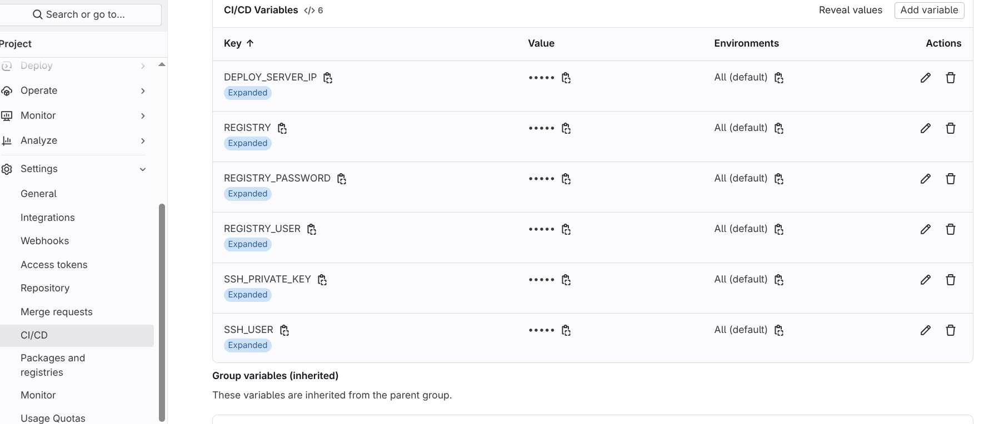
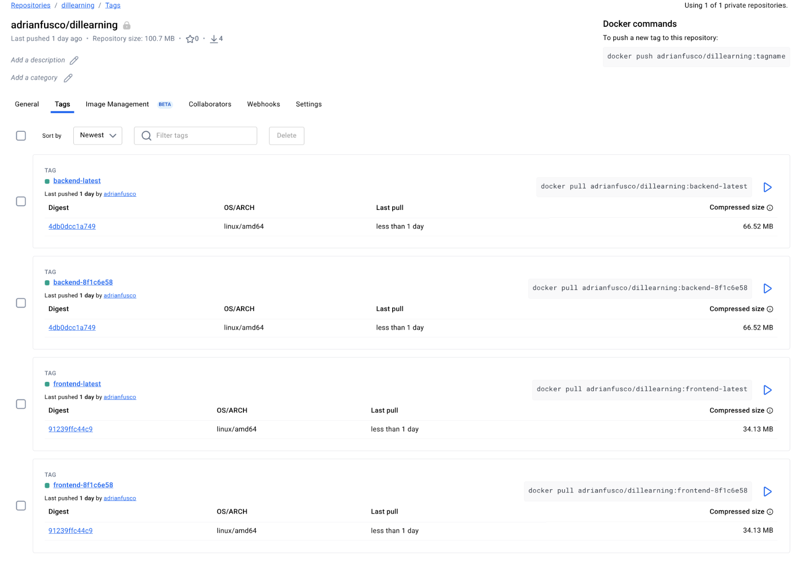
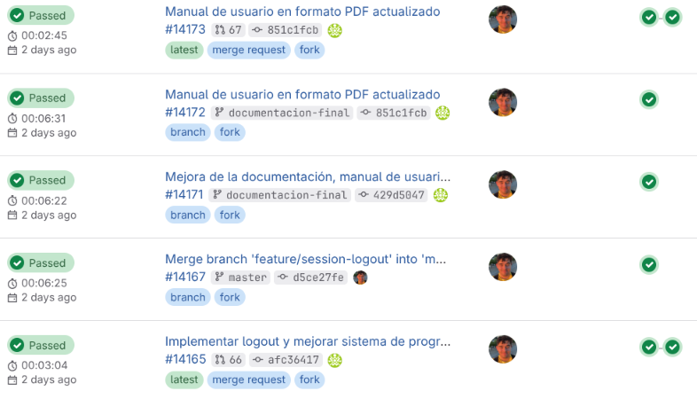

# Dillearning

**Dillearning** (*dil del Turco idioma o lengua*) es una aplicación de aprendizaje de idiomas que busca ofrecer una experiencia amigable,
transparente y enriquecedora para el usuario, añadiendo
temas que son más orientados a un uso más realista del
lenguaje con un enfoque pedagógico sin ser un modelo orientado a la monetización.


## Autor

Soy Adrián y trabajo como Software Engineer en Red Hat desde hace 4 años con un enfoque bastante enfocado a DevOps. Comencé un rol en un equipo llamado Code Reliability Engineering y actualmente me encuentro en un equipo llamado CI Operations en Openstack.

He trabajado en los últimos años principalmente con **Python**.

He querido trabajar en este proyecto porque ya he podido abarcar el área web trabajando con aplicaciones internas hechas en **Fast API** - y en ocasiones **Flask** - para el backend y **React** con **Tailwindcss** para el frontend.

Esta vez quería aprender sobre **Dart** y **Flutter** para realizar aplicaciones multiplataforma y al encantarme los idiomas quería aprovechar la ocasión para realizar una aplicación que ayude con el aprendizaje.

Podéis encontrarme en [LinkedIn](https://www.linkedin.com/in/adrianfusco/).

## Setup

La forma más sencilla de levantar todo el entorno es usando [docker-compose.yml](./docker-compose.yml) que se encuentra en la raíz del proyecto.

Ejecutamos:

```bash
docker compose up --build
```

Esto levantará todos los servicios necesarios:

- **frontend**: La aplicación Flutter después del build para web y servida con nginx en el puerto `8080`.
- **backend**: La API de FastAPI que se ejecuta en el puerto `8000`.
- **ollama**: El servicio de IA que se ejecuta en el puerto `11434`.

Una vez que todo esté en funcionamiento, puedes acceder a la aplicación en [http://localhost:8080](http://localhost:8080).

Luego si queremos ejecutar para desarrollo tenemos en las siguientes secciones READMEs propios para frontend y backend.

## Frontend

El frontend está desarrollado con [Flutter](https://flutter.dev/). Para instrucciones debemos consultar [README de dillearning](./dillearning/README.md).

## Backend

El backend está desarrollado en Python usando FastAPI y se comunica con un servicio de Ollama para las funcionalidades de IA.

Para instrucciones detalladas sobre el backend debemos consultar [README.md dillearning-backend](./dillearning-backend/README.md).

## CI/CD

El proyecto cuenta con un pipeline de CI/CD configurado en el fichero [.gitlab-ci.yml](./.gitlab-ci.yml) que se encarga de:

- **linters**: Ejecutar linters para el código de frontend y backend.
- **build**: Crear los artefactos de la aplicación para las distintas plataformas (web, Android, Linux).
- **publish**: Publicar las imágenes de backend y frontend en un registro de contenedores.
- **deploy**: En este caso y solo para probar nuestra aplicación en producción usando un método que no tiene porque con high availability, he usado docker compose para correr las aplicaciones y hacer uso de las imágenes que publicamos en el registry. Así, cada vez que se haga un cambio en el código y se mergee, se genera una nueva tag en el registry haciendo uso del commit que hemos hecho.

Para hacer publicar nuestra imagen y hacer el deploy necesitamos las siguientes variables configuradas en GitLab en el proyecto:

.

El build de nuestras imágenes que se hizo con los Dockerfile tanto del frontend como del backend se verá similar a:

.

Y podemos ver en Build -> Pipelines los jobs que se han ejecutado:

.

## Scripts

El proyecto cuenta con una serie de scripts en la carpeta [scripts](./scripts) que facilitan algunas tareas:

- [create_frontend_deb_package.sh](./scripts/create_frontend_deb_package.sh): Crea un paquete `.deb` para la aplicación frontend en Linux.

En este caso podemos probar el paquete en un contenedor:

```
$ podman run -it --rm \
  --env DISPLAY=$DISPLAY \
  --volume /tmp/.X11-unix:/tmp/.X11-unix \
  --volume $(echo $XAUTHORITY):/root/.Xauthority \
  -v $(pwd)/dillearning/build/linux/x64/release/bundle/dillearning-1.0.0-amd64.deb:/tmp/dillearning.deb \
  ubuntu:24.04 bash -c "
    apt update &&
    apt install -y mesa-utils libgl1 libglvnd0 libglu1-mesa &&
    dpkg -i /tmp/dillearning.deb &&
    apt-get -f install -y &&
    dillearning
  "
```

Pero en este caso hacer el build necesitaremos pasarle la URL correcta de la API para que pueda comunicarse desde la aplicación de desktop. Este paso no está cubierto y es a prueba de como hacer el build para Linux y usar la aplicación.

## Otra documentación

*   [1. Propuesta de Proyecto](documentacion/1_proposta.md)
*   [2. Anteproyecto](documentacion/2_anteproxecto.md)
*   [3. Prototipos y Seguimiento](documentacion/3_prototipos.md)
*   [4. Documentación Final](documentacion/4_documentacion_final.md)
    *   [Manual de Usuario (HTML)](documentacion/4_manual_usuario.html)
    *   [Manual de Usuario (PDF)](documentacion/manual_usuario.pdf)
*   [5. Defensa del Proyecto](documentacion/5_defensa.md)
*   [README de Diagramas](documentacion/diagramas/README.md)
*   [README de Imágenes](documentacion/img/README.md)


## Code

Licensed under the Apache License, Version 2.0 (the "License");
you may not use this file except in compliance with the License.
You may obtain a copy of the License at

    http://www.apache.org/licenses/LICENSE-2.0

Ver [LICENSE](./LICENSE)


## Logo

El logo ha sido creado con:

Logo: [Language 04 SVG Vector - Creative Commons Zero license](https://www.svgrepo.com/svg/339310/language-04)

Y el texto con efecto bend lo añadido con Inkscape :D
