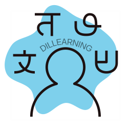

# Dillearning

**Dillearning** (*dil del Turco idioma o lengua*) es una aplicación de aprendizaje de idiomas que busca ofrecer una experiencia amigable,
transparente y enriquecedora para el usuario, añadiendo
temas que son más orientados a un uso más realista del
lenguaje con un enfoque pedagógico sin ser un modelo orientado a la monetización.



## Autor

Soy Adrián y trabajo como Software Engineer en Red Hat desde hace 4 años con un enfoque bastante enfocado a DevOps. Comencé un rol en un equipo llamado Code Reliability Engineering y actualmente me encuentro en un equipo llamado CI Operations en Openstack.

He trabajado en los últimos años principalmente con **Python**.

He querido trabajar en este proyecto porque ya he podido abarcar el área web trabajando con aplicaciones internas hechas en **Fast API** - y en ocasiones **Flask** - para el backend y **React** con **Tailwindcss** para el frontend.

Esta vez quería aprender sobre **Dart** y **Flutter** para realizar aplicaciones multiplataforma y al encantarme los idiomas quería aprovechar la ocasión para realizar una aplicación que ayude con el aprendizaje.

Podéis encontrarme en [LinkedIn](https://www.linkedin.com/in/adrianfusco/).

## Setup

La forma más sencilla de levantar todo el entorno es usando [docker-compose.yml](./docker-compose.yml) que se encuentra en la raíz del proyecto.

Ejecutamos:

```bash
docker compose up --build
```

Esto levantará todos los servicios necesarios:

- **frontend**: La aplicación Flutter después del build para web y servida con nginx en el puerto `8080`.
- **backend**: La API de FastAPI que se ejecuta en el puerto `8000`.
- **ollama**: El servicio de IA que se ejecuta en el puerto `11434`.

Una vez que todo esté en funcionamiento, puedes acceder a la aplicación en [http://localhost:8080](http://localhost:8080).

Luego si queremos ejecutar para desarrollo tenemos en las siguientes secciones READMEs propios para frontend y backend.

## Frontend

El frontend está desarrollado con [Flutter](https://flutter.dev/). Para instrucciones debemos consultar [README de dillearning](./dillearning/README.md).

## Backend

El backend está desarrollado en Python usando FastAPI y se comunica con un servicio de Ollama para las funcionalidades de IA.

Para instrucciones detalladas sobre el backend debemos consultar [README.md dillearning-backend](./dillearning-backend/README.md).

## Otra documentación

- [Propuesta de proyecto](./documentacion/1_proposta.md)
- [Anteproyecto, justificación, finalidades, diseños y diagramas](./documentacion/2_anteproxecto.md)
- [Prototipos, seguimiento, problemas encontrados y soluciones adoptadas](./documentacion/3_prototipos.md)

## Code

Licensed under the Apache License, Version 2.0 (the "License");
you may not use this file except in compliance with the License.
You may obtain a copy of the License at

    http://www.apache.org/licenses/LICENSE-2.0

Ver [LICENSE](./LICENSE)


## Logo

El logo ha sido creado con:

Logo: [Language 04 SVG Vector - Creative Commons Zero license](https://www.svgrepo.com/svg/339310/language-04)

Y el texto con efecto bend lo añadido con Inkscape :D
