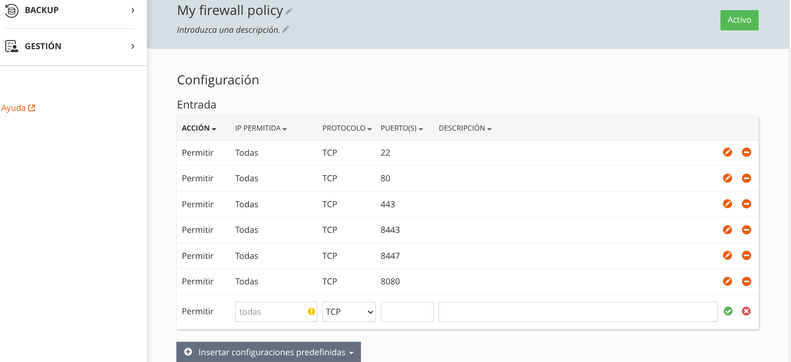

# ENTREGA FINAL

# Resultado del proyecto

# Cambios entre el proyecto final y el anteproyecto

Al final he expandido más el proyecto añadiendo un despliegue a un servidor VPS contratado. En este caso es solamente para demostrar como funcionaría el CI/CD por lo que no con tiene las mejores prácticas en cuanto a alta disponibilidad.
En este caso estoy usando kaniko para hacer un build de las imágenes del frontend y el backend, hacemos un tag usando el commit más reciente de la MR donde hacemos el cambio en el código y hacemos un push.
Luego en producción lo que hacemos es un rebuild del docker compose para usar la imagen más reciente. De nuevo, esto es para tener en producción la aplicación y demostrar un ejemplo del ciclo completo de CI/CD incluyendo un despliegue. No está pensado para high availability.

# Manual Técnico

Toda la documentación técnica está bien especificada en:

- [README.md base proyecto](../README.md)
- [README.md dillearning backend - API](../dillearning-backend/README.md)
- [README.md dillearning frontend - Flutter](../dillearning/README.md)

Además, los diagramas clave del proyecto se encuentran en la carpeta `documentacion/diagramas/`:

- [Diagrama de Arquitectura del Sistema](./diagramas/arquitectura_sistema.png)
- [Diagrama de Persistencia de Datos](./diagramas/persistencia_datos_esquema_bd.png)
- [Diagrama de Interfaz de Usuario](./diagramas/interfaz_usuario.png)

Hay que tener en cuenta a la hora de desplegar en servicios de cloud / hosting abrir puertos del firewall.
En este caso como estamos desplegando usando el puerto 8080 como ejemplo tuve que abrir ese puerto:

- 

# Manual de Usuario

He implementado el manual de usuario usando [revealjs](https://revealjs.com/) que ofrece la manera de construir una web con forma de diapositivas de forma muy sencilla y permite exportarlo a PDF. De esta manera tenemos ambas versiones.

El manual está en [./4_manual_usuario.html](./4_manual_usuario.html) y podemos abrirlo en un navegador. Si añadimos el parámetro `?print-pdf` en la URL nos permite tener una mejor vista para luego imprimir o guardar en PDF.

El PDF generado está en [./manual_usuario.pdf](./manual_usuario.pdf)
